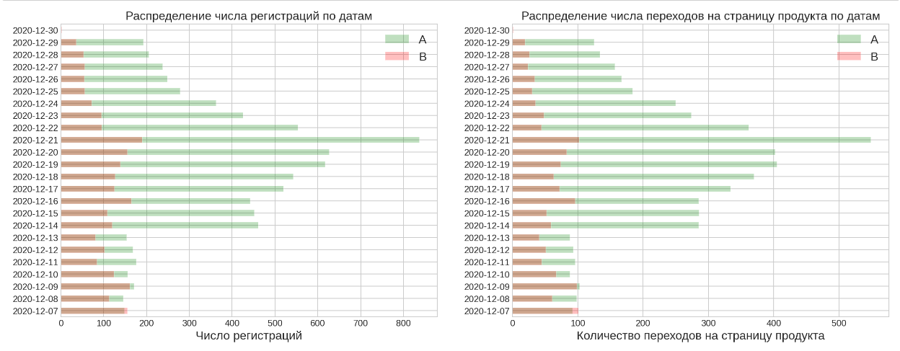

# Оценка результатов A/B-теста

## Цель
Провести анализ влияния маркетинговой акции на метрики интернет-магазина.

## Данные

Использованы данные о маркетинговых акциях, логи пользователей и событий.

## Задача

Проведение анализ результатов АВ-теста. В ходе исследования проведена обработка данных - удалены пропуски, осуществлена корректировка  периода анализа. Проведен исследовательский анализ данных для проверки корректности проведения теста, осуществлена оценка результатов тестирования на конверсию в шаг - проведена оценка статистической значимости и проверка гипотез.

## Используемые библиотеки
*pandas, scipy, statsmodels, matplotlib*

## Скриншоты

