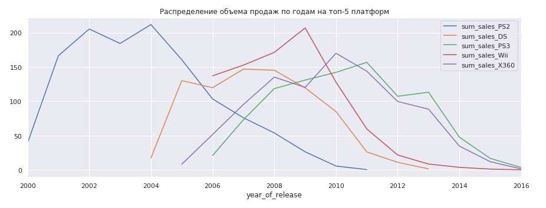
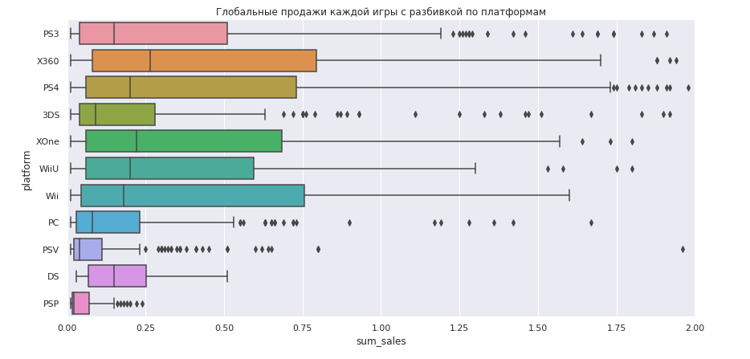

# Оценка успешности продаж для планирования рекламы

## Цель
Провести анализ интернет-магазина игр для определения игровых платформ под новую рекламную компанию. 

## Данные

Входные данные содержат информацию об играх (Name), игровых платформах (Platform), годе выпуска (Year_of_Release), игровом жанре (Genre), объемах региональных продаж ( NA, EU, JP, Other), оценочных рейтингах критиков (Critic_Score) и пользователей (User_Score), а также присвоенном рейтинге игры (Rating).

## Задача
 
На основании исторических данных о продажах игр выявить определяющие успешность игры закономерности. Выявить на рынке компьютерных игр потенциально популярный продукт для планирования рекламной кампании для интернет-магазина.
В ходе анализа проведена подготовка данных для приведения к требуемому типу, проведен исследовательский анализ данных для выявления закономерностей. Сформирован портрет пользователя магазина для каждого региона и проверены гипотезы о зависимости пользовательких  рейтингов от типа игровой платформы и игровых жанрах. Сделаны выводы о закономерностях определяющих успешность игры.

## Используемые библиотеки
*numpy, pandas, scipy, matplotlib, seaborn*

## Скриншоты

