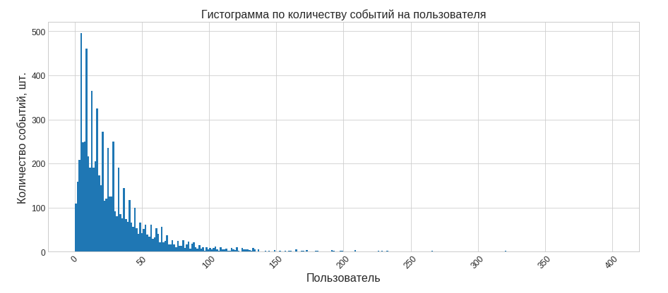
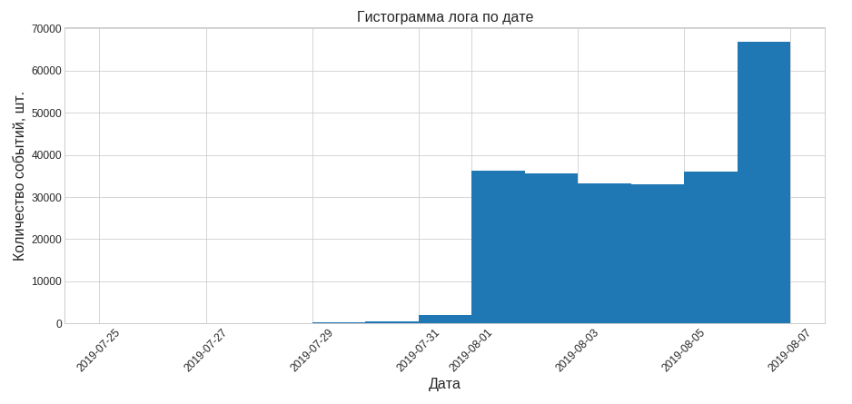
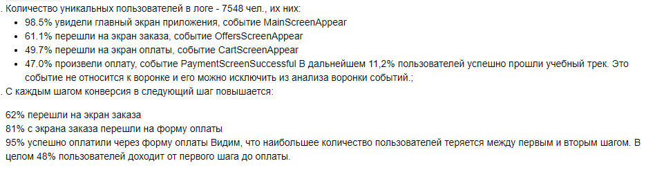

# Оценка влияния дизайна приложения на воронку продаж

## Цель
Дать рекомендации по работе с воронкой событий и изменению шрифтов мобильного приложения. 

## Данные

Лог событий приложения с разбивкой по аудитории AB-теста.

## Задача

Анализ воронки событий мобильного приложения по результатам AB-теста: анализ конверсии по шагам воронки,оценка результатов A/A/B-эксперимента.
В ходе анализа проведены проверка данных и исследовательский анализ даных для подготовки данных. Построена и изучена воронка событий приложения, определена конверсия в шаг. Произведено сравнение контрольных выборок и тестовой, рассчитана статистическая значимость разницы. Сделаны выводы по результатам эксперимента о влиянии изменений приложения на воронку событий.

## Используемые библиотеки
*pandas, scipy, matplotlib*

## Скриншоты

