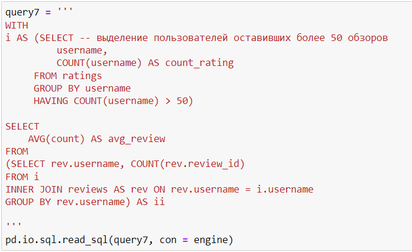

# Анализ сервиса для чтения книг по подписке

## Цель
Сформулировать ценностное предложение для нового продукта - сервиса для чтения книг по подписке.

## Данные

Подключение к базе данных сервиса содержащей информацию о транзакциях с книгами.

## Задача

Провести анализ базы данных сервиса для чтения книг по подписке, сформировать выводы и предложения по результатам анализа. В ходе осуществлено удаленное подключение к базе данных средствами библиотеки sqlalchemy, сформированы sql-запросы.

## Используемые библиотеки
*pandas, sqlalchemy*

## Скриншоты

