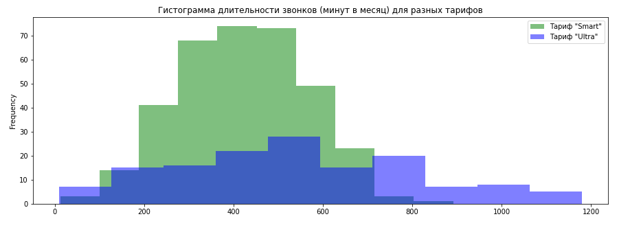
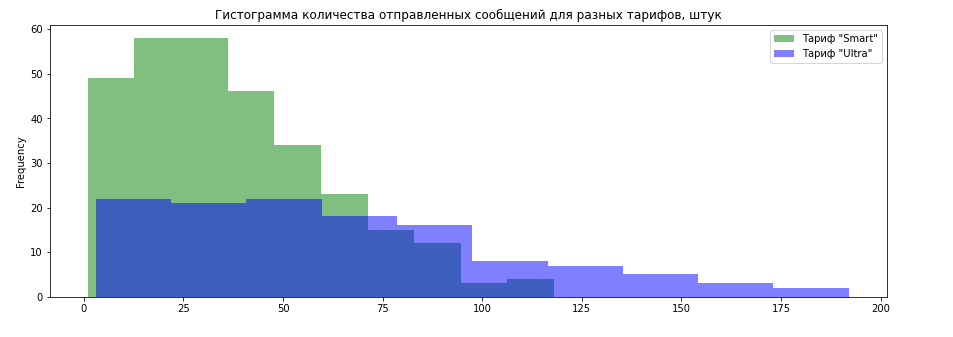
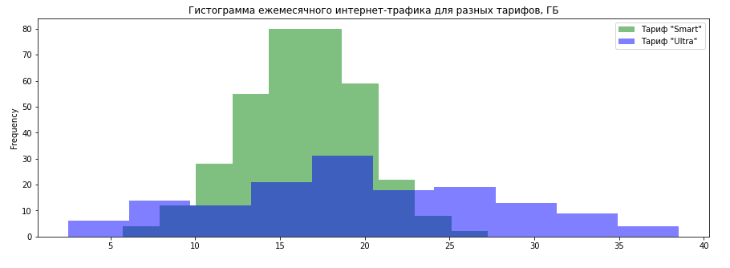

# Определение перспективного для продвижения продукта

## Цель
Дать рекомендации для планирования рекламы и продвижения тарифов мобильного оператора. 

## Данные

Логи звонков и потребления интернет-трафика.

## Задача

Анализ тарифов сотовой компании на основе анализа поведения клиентов - требуется определить какой тариф лучше и приносит больше денег.
В ходе анализа проведена предобработка данных для приведения к требуемым типам, проведен исследовательский анализ данных. Проведен статистический анализ данных и проверены гипотезы по различию выручки пользователей разных тарифов, влиянию на выручку места проживания пользователей.

## Используемые библиотеки
*numpy, pandas, scipy, matplotlib*

## Скриншоты

