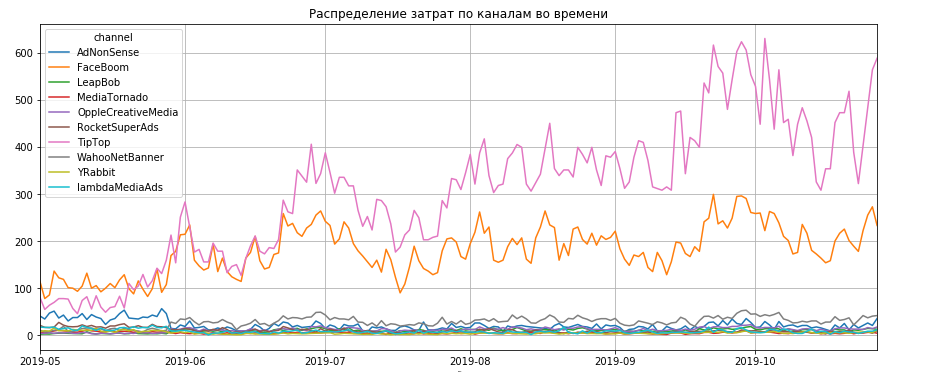
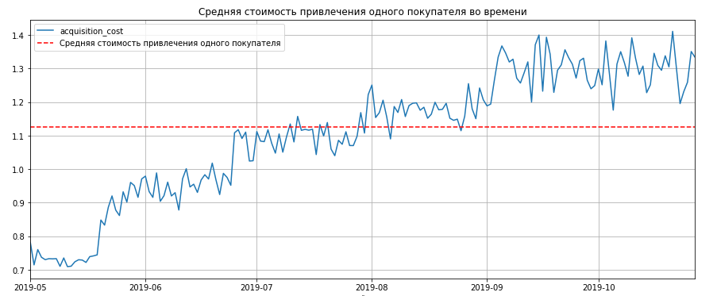
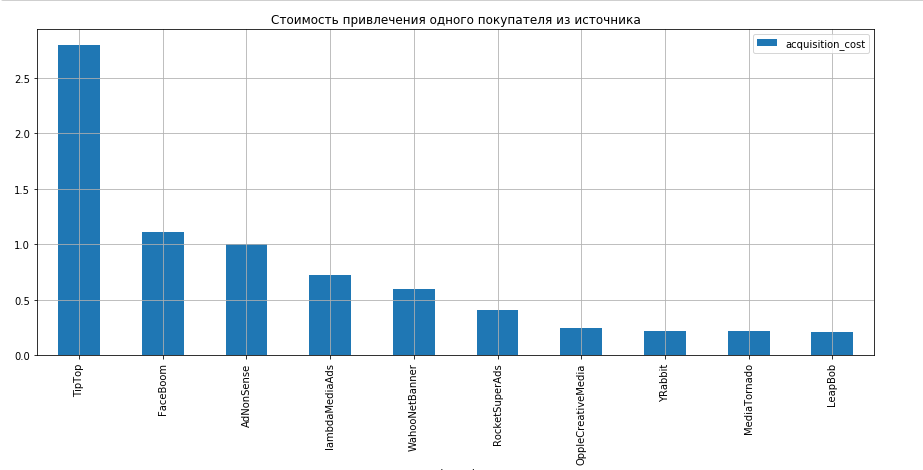
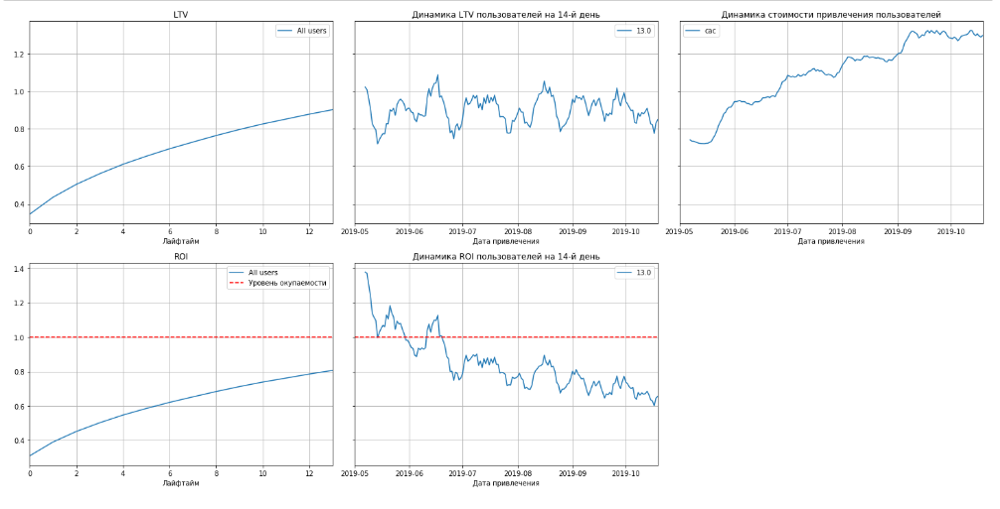
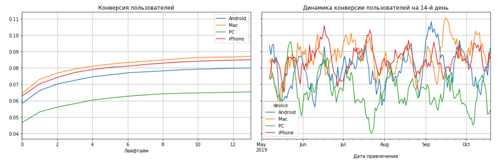
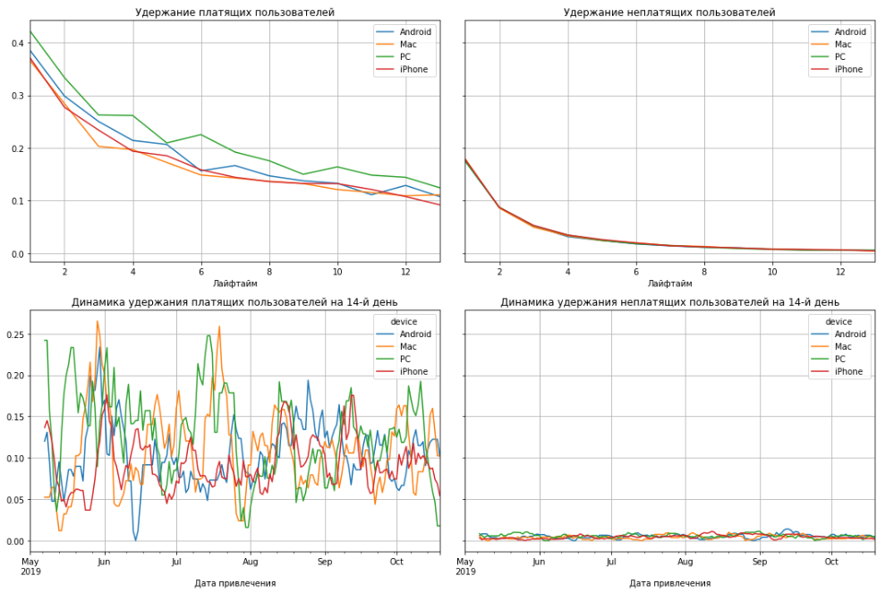

# Анализ продуктовой воронки

## Цель
Выявить какие факторы отрицательно влияют на привлечение пользователей приложения. 

## Данные

Логи сессий использования мобильного приложения.

## Задача

Анализ развлекательного приложения по эффектности привлечения и удержания клиентов: проанализировать причины отсутствия прибыли от приложения, на основании имеющихся данных.
В ходе анализа произведены исследовательский анализ данных, расчет и анализ показателей LTV, ROI, удержания и конверсии. Показатели визуализованы. Произведен анализ затрат на маркетинг по врени и каналам затрат, оценена средняя стоимость покупателя во времени и по источникам привлечения. Осуществлена оценка окупаемости рекламы с разбивкой по рекламным каналам, сделаны выводы и даны рекомендации по повышению эффективности рекламных затрат.

## Используемые библиотеки
*numpy, pandas, matplotlib*

## Скриншоты

