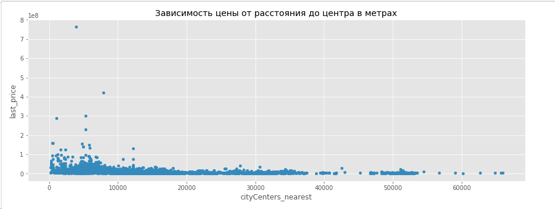
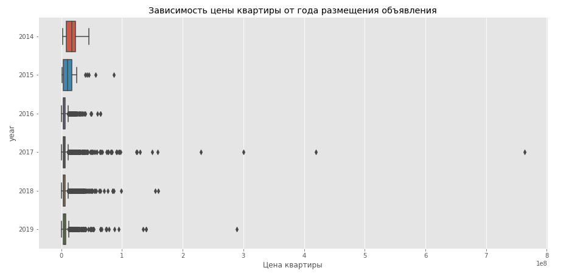
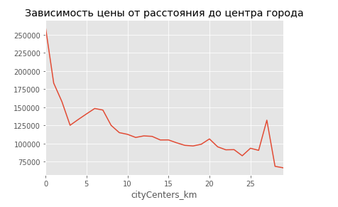
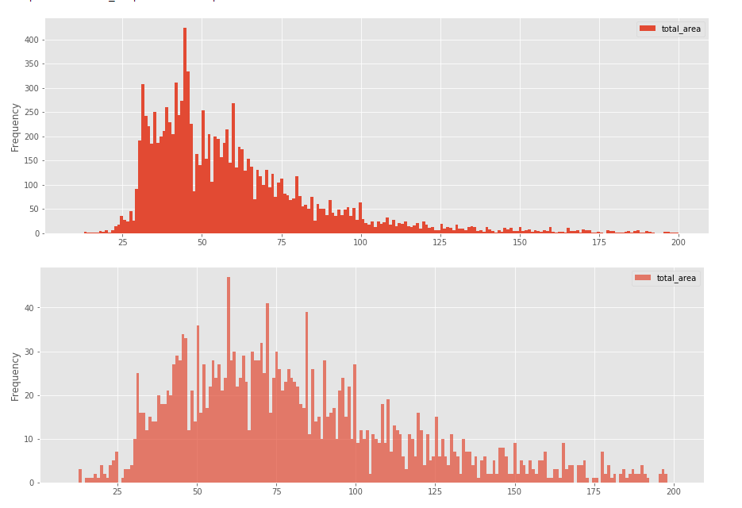
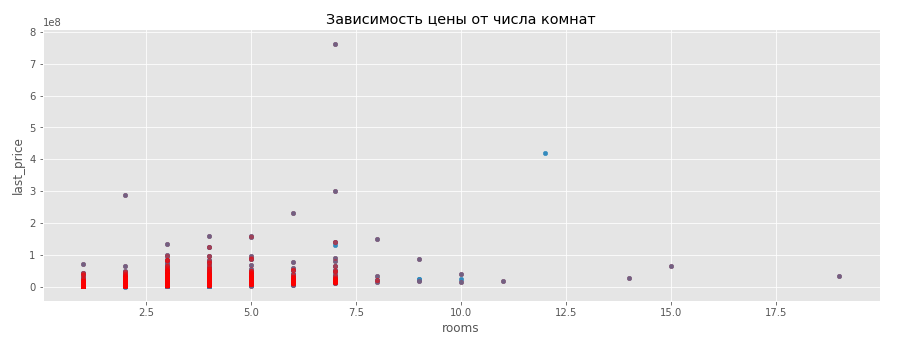
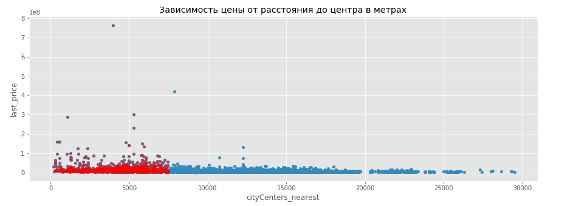

# Ключевые параметры цены недвижимости в Санкт-Петербурге

## Цель
Построение автоматизированной проверки обоснованности цены на недвижимость в объявлениях.

## Данные

Архив объявлений о продаже квартир в Санкт-Петербурге и соседних населённых пунктах за несколько лет. Часть анализируемых данных получена из автоматизированных систем.

## Задача

Исследование объявлений о продаже квартир в Санкт-Петербурге и выявить параметры наиболее сильно влияющие на стоимость недвижимости.
В ходе анализа осуществлена предобработка данных для заполения пропусков и приведения к нужным типам данных. Проведен исследовательский анализ данных, выявлены зависимости показателей и определены ключевые для стоимости недвижимости. Сделаны выводы о трех ключевых показателях. 

## Используемые библиотеки
*pandas, matplotlib, seaborn*

## Скриншоты

