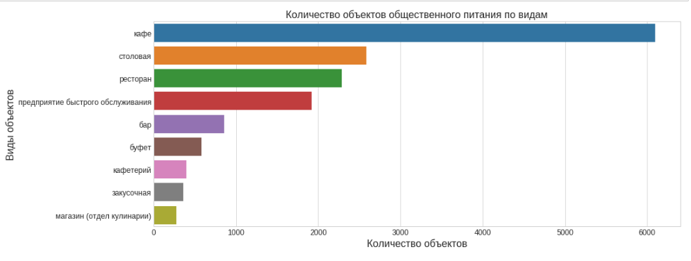
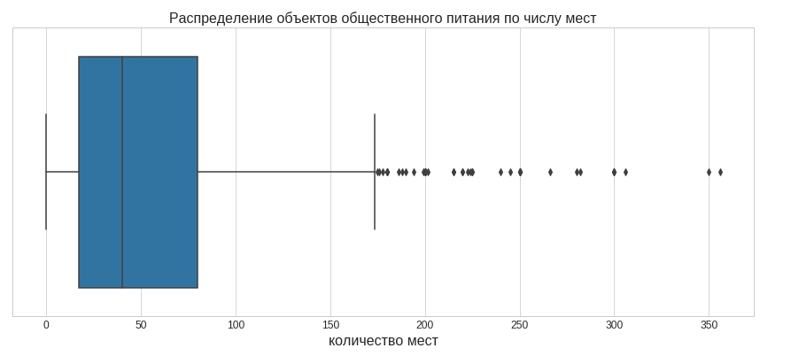
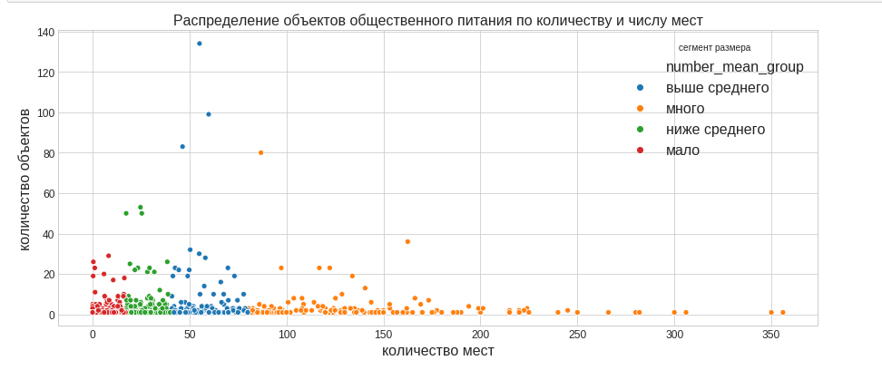
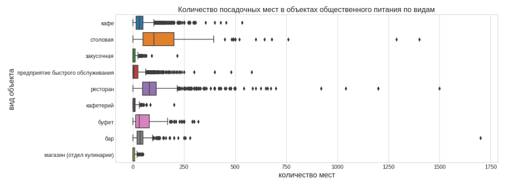
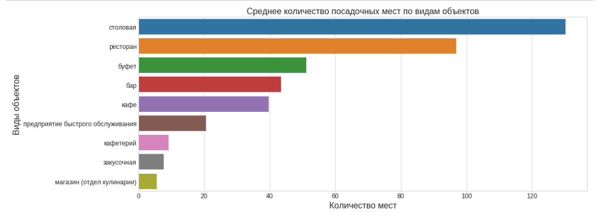
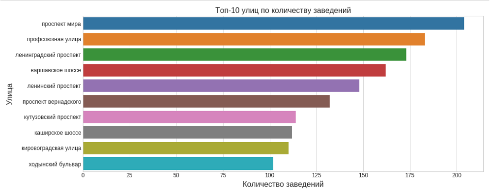

# Выбор места для отрытия кафе

## Цель
Дать рекомендации по открытию небольшого нового кафе: район, количество мест, вид заведения.

## Данные

Информация о ключевых параметрах и расположении кафе г.Москва.

## Задача

Анализ рынка для открытия нового кафе в Москве исходя из критериев:

- виды заведений
- количество посадочных мест
- месторасположение.

В ходе анализа выделены маркеры улиц для определения уникальных названий, использованы открытые данные о районах Москвы для составленя ТОП-10 улиц.

## Используемые библиотеки
*pandas, scipy, сounter, matplotlib, seaborn*

## Скриншоты

