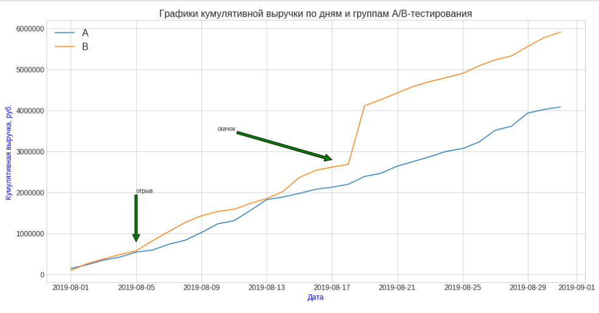
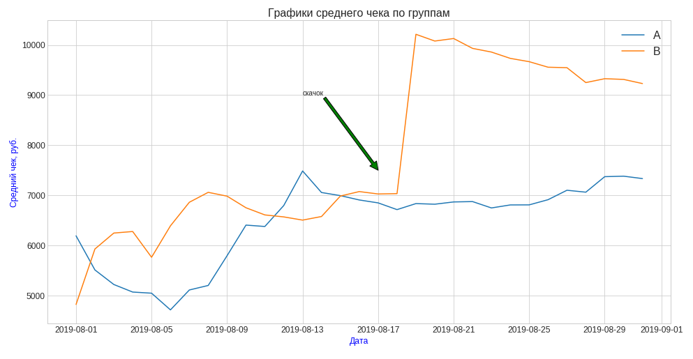
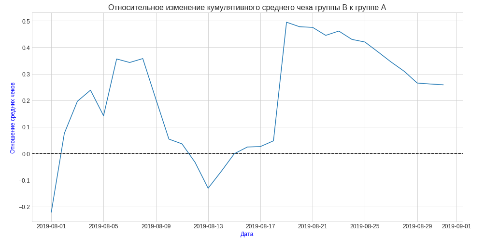
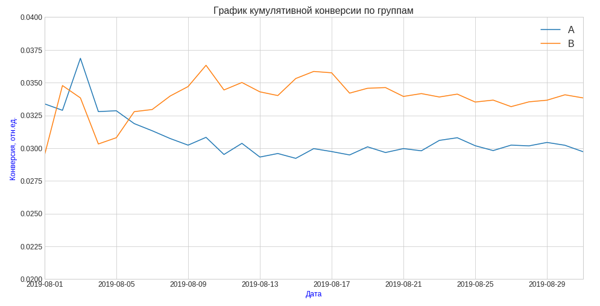
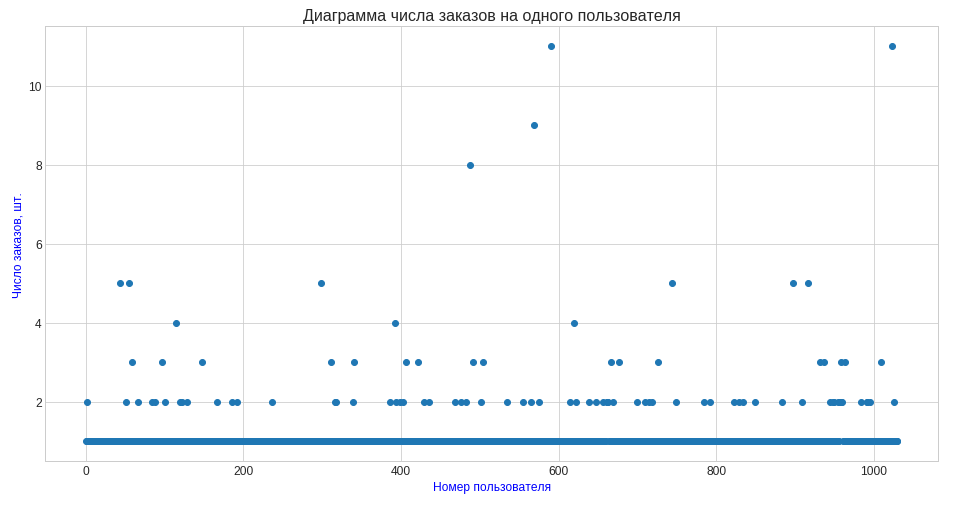
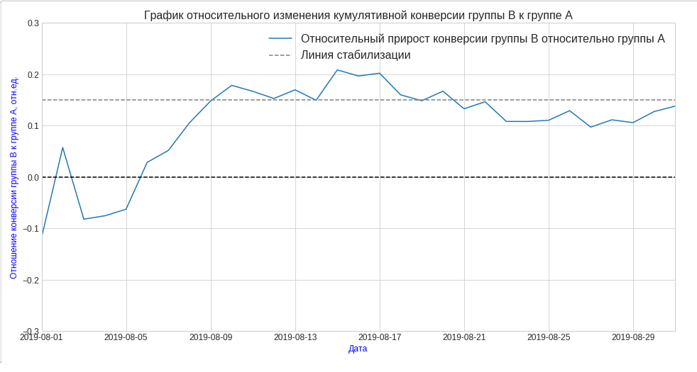

# Оценка результатов A/B-теста

## Цель
Принять решение по результатам A/B-теста.

## Данные

Лог транзакций и данные о пользователях интернет-магазина с разбивкой по группам тестирования.

## Задача

Анализ интернет-магазина для целей увеличения выручки по результатам AB-тестирования:

- приоритизировать подготовленный список гипотез для увеличения выручки
- проанализировать результаты проведенного A/B теста.

В ходе анализа проведена предобработка данных для приведения к нужным форматам, осуществлен исследовательский анализ данных и анализ данных AB-теста с определением кумулятивных метрик выручки, среднего чека, конверсии по каждой из групп. Определены и учтены аномальные заказы. Определена статистическая значимость различий в конверсии на сырых и очищенных данных. 

## Используемые библиотеки
*pandas, scipy, matplotlib*

## Скриншоты

