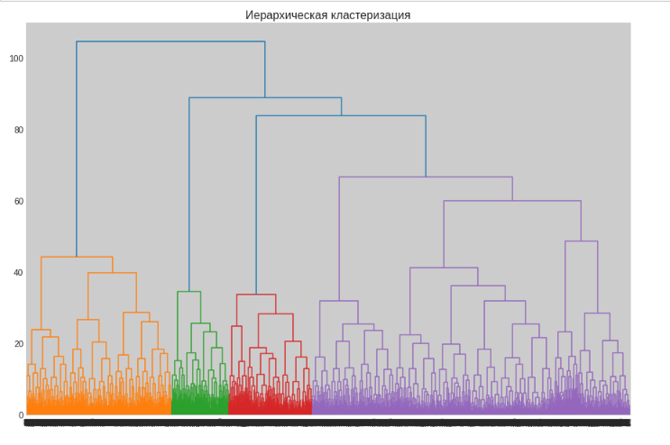

# Сегментация клиентов для целей удержания

## Цель
Разработать рекомендации по повышению качества работы с клиентами.

## Данные

Аналитический отчет в разрезе клиентов компании.

## Задача

Осуществлен анализ оттока клиентов сети фитнес-центров и формирование рекомендаций по работе с клиентской базой.
В ходе анализа проведен исследовательский анализ данных, построена модель прогнозирования оттока клиентов на базе логистической регрессии. Вычислено оптимальное количество кластеров методом иерархической кластеризации, обучена модель кластеризации на основании алгоритма K-means.

## Используемые библиотеки
*numpy, pandas, sklearn, itertools, matplotlib, seaborn*

## Скриншоты

