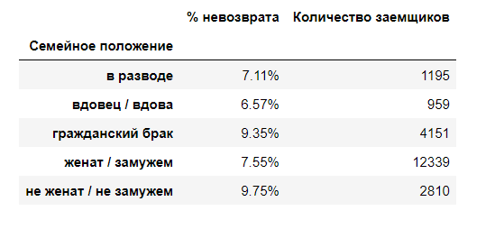
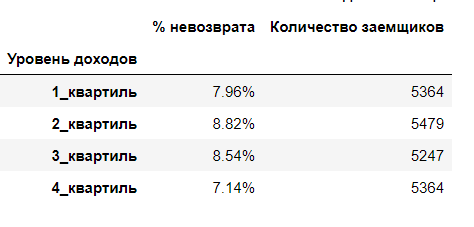
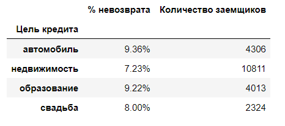
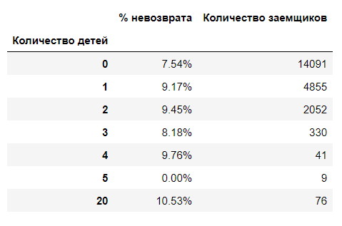

# Актуализация показателей кредитного скорринга

## Цель
Определить влияет ли семейное положение и количество детей клиента на факт погашения кредита в срок.

## Данные

Статистика о платёжеспособности клиентов.

## Задача

Исследование надёжности заёмщиков для актуализации показателей системы кредитного скорринга физических лиц.
В ходе исследования проведена обработка данных - запущены пропуски, исправлены ошибки, удалены неявные дубликаты с использованием библиотеки лемматизации, осуществлена категориризация данных.

## Используемые библиотеки
*pandas, pymystem3*

## Скриншоты

